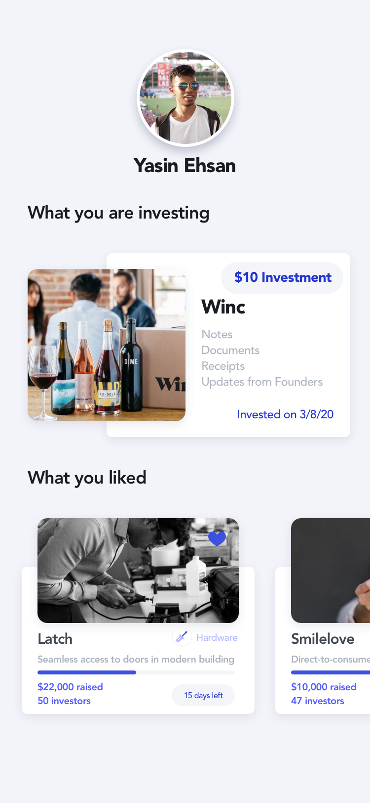
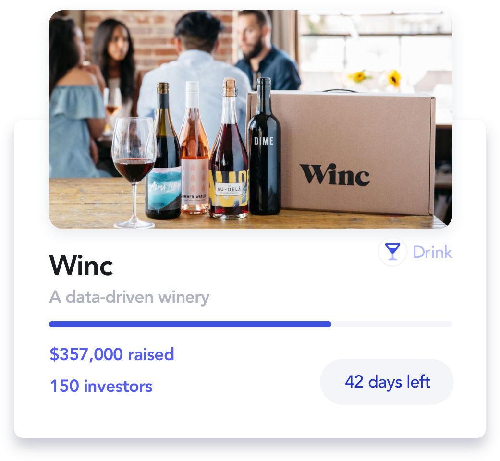

# SeedIt

**My Linkedin Post** I've been asked a lot what I do. Here's my pitch as if you were the judge:

(Elevator pitch) Today startups with exponential looking growth curves get funded hundred-million-dollar checks by venture capitalists and angel investors i.e. Softbank and WeWork

Most of our economy, tho, is made of businesses with more humble growth trajectories if any. Most people today have some money saved - if they even do - but hardly enough for a house down payment ~150-200k in NYC. 

Seedit is an app for small businesses to get crowdfunded by small investors for equity

(Touch/feel demo) Here's our app with wow factor: working payment process. 

(Beyond the bar) NodeJs is a runtime environment making mobile/web apps browser-agnostic. Our working payment server is hosted on Heroku and our ios app uses Google Cloud. Using Kubernetes allows us to achieve cloud-agnostic. 

What gets me excited about these hackathons is not code, nor clout - which is great - but ideation. I love coming up with ideas that solve real-world problems and I feel each hackathon is a day closer to making that feeling actually true.
---

To my team : you bring the best out of me, you are a beast at what you do and I look forward to growing further together 

**About:** A platform for startups and new brands to market and share their business for investors to view and help grow. Allows for investors to view startups based on location and industry in a seamless way. Also allows for transactions to take place directly in the app in real time between both parties. 

**Built With:** Swift, Xcode, Zeplin, Google Cloud, Firebase, Speech Recognition, Stripe API 

**Frameworks:** UIKit, MapKit, CoreLocation, FlyoverKit, UserNotifications, EventKit, Contacts, Firebase, Parse, Authentication, SpeechKit, iCarousel

## [Video Walkthrough](https://drive.google.com/file/d/1XRuPFrXK-Oo59HzjUoGmqqwhh42T6UDm/view?usp=sharing)

  

  
  
   

<!--    -->
  <!--  -->
  <!--  -->

 

## Stand-Ups / Milestones
- [x] (Design) Wireframes
- [x] (Design) Zeplin components
- [x] (Native) Create boilerplate w rotating map
- [x] (Backend) Connect double segmented market to non-relational database
- [x] (Native) Implement Apple Calnder and Apple Map transitions

## Roadblocks Overcame
- **Pull Requests** with differnt pod folders and stroyboard edits in different branches
- **Async calls** View Controller life cycle order of call between delegate and protocol methods
- **Geofence Limitation** Apple Places a limatation on tracking 20 physical barriers at a time
    - We came up w an algorithim that works around that limitation w/o eating the battery

## Useful Links
- [git ignore + storyboard merge conflict resolves](https://guides.codepath.com/ios/Using-Git-with-Terminal)
- [pod merge conflict](https://medium.com/@amlcurran/how-to-deal-with-conflicts-in-pod-folders-2eb9fa20f465)
- [Apple ML Kit](https://www.youtube.com/watch?v=p6GA8ODlnX0)
- [Microsoft ML Studio](https://studio.azureml.net/)

## Team
- Backend: **Yasin Ehsan**, Queens College
- Native & Frontend: **Helal Chowdhury**, NYU
- UI/UX Designier: **Meng Shi***, Baruch
- Backend: **Jagnaudh***, Baruch College
